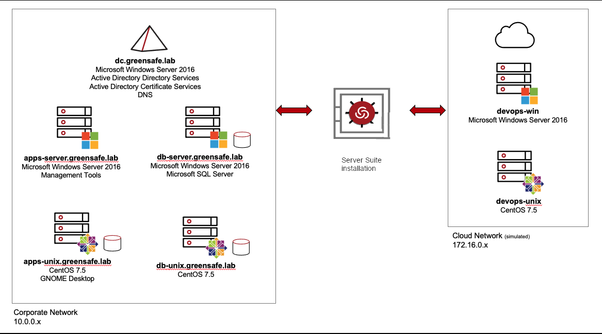

.. title:: ThycoticCentrify - Server Suite Handson Training

.. toctree::
   :maxdepth: 2
   :caption: Lab 1
   :name: _l1
   :hidden:

   lab1/lab1
  
.. toctree::
   :maxdepth: 2
   :caption: Lab 2
   :name: _l2
   :hidden:

   lab2/lab2
   
.. toctree::
   :maxdepth: 2
   :caption: Lab 3
   :name: _l3
   :hidden:

   lab3/lab3

.. toctree::
   :maxdepth: 2
   :caption: Lab 4
   :name: _l4
   :hidden:

   lab4/lab4

.. toctree::
   :maxdepth: 2
   :caption: Lab 5
   :name: _l5
   :hidden:

   lab5/lab5

.. toctree::
   :maxdepth: 2
   :caption: Lab 6
   :name: _l6
   :hidden:

   lab6/lab6

.. toctree::
   :maxdepth: 2
   :caption: Lab 7
   :name: _l7
   :hidden:

   lab7/lab7

.. toctree::
   :maxdepth: 2
   :caption: Lab 8
   :name: _l8
   :hidden:

   lab8/lab8

.. toctree::
   :maxdepth: 2
   :caption: Lab 9
   :name: _l9
   :hidden:

   lab9/lab9

.. toctree::
   :maxdepth: 2
   :caption: Lab 10
   :name: _l10
   :hidden:

   lab10/lab10

.. toctree::
   :maxdepth: 2
   :caption: Lab 11
   :name: _l11
   :hidden:

   lab11/lab11

.. _getting_started:

----------------
About this guide
----------------

This hands-on exercise guide will walk you through the fundamental features and functionality of Centrify Server Suite. You will be working with several computer systems as you complete each exercise, however not all systems will need to be powered during each lab exercise. Before each lab begins you will be provided initial instructions related to required systems. This is done to conserve resources in the virtual environment.

| If you plan to use the training materials for in-house training, you can configure a training environment in your network, but it is recommended to consider your network configurations and security practices. This environment is for training purposes and will not match your network environment. Use the **Appendix** in the **Student Guide** to read more about the training environment and how it is configured.

| During this training, you will be working with Greensafe Payroll Services. Alex Foster is the primary administrator of the Infrastructure. Greensafe’s network includes a Windows Active Directory domain controller, one (A) Windows Application Server, one (1) Microsoft SQL Server, and two (2) UNIX servers. A “cloud” environment is also used for DevOps and includes two independent non-AD joined servers. As part of the purchase of Centrify Server Suite, a SaaS based Centrify Identity Platform (tenant) has been provided to facilitate the management of the environment.

------

Start the lab :ref:`l1`