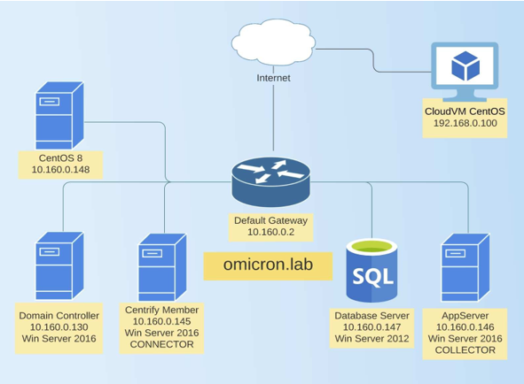

.. title:: ThycoticCentrify - Testdrive

.. toctree::
   :maxdepth: 2
   :caption: Module 1
   :name: _m1
   :hidden:

   module1/module1

.. toctree::
   :maxdepth: 2
   :caption: Module 2
   :name: _m2
   :hidden:

   module2/module2

.. toctree::
   :maxdepth: 2
   :caption: Module 3
   :name: _m3
   :hidden:

   module3/module3

.. toctree::
   :maxdepth: 2
   :caption: Module 4
   :name: _m4
   :hidden:

   module4/module4

.. toctree::
   :maxdepth: 2
   :caption: Module 5
   :name: _m5
   :hidden:

   module5/module5

.. _getting_started:

------------
Introduction
------------

The purpose of this guide is to provide configuration options that follow industry-proven best practices when working with the Centrify solutions. This guide is used in conjunction with a fully configured virtual environment (hosted by Skytap) where you can participate in the hands-on experience of working with the Centrify Platform, Centrify Authentication Service, Centrify Privilege Elevation Service, as well as Centrify Audit and Monitoring Service.
This guide breaks down step-by-step configurations and product features that you can follow and adjust to match some of your common company security practices. Contact your Centrify Systems Engineer if you have questions or need further assistance in mirroring challenges you may have in your own production environment.

Your Virtual Environment
------------------------

The diagram below describes the virtual environment that is available to you during this Centrify Test Drive. It includes a domain controller, a Microsoft® Windows® Application Server, a Microsoft SQL Server, a Microsoft Windows Server that is used for Centrify Applications, one CentOS 8 system that is joined to the domain, and one CentOS system that is outside the network.

.. list-table::
    :widths: 50 50

    * - Domain Admins
      - Alex Foster (afoster)
    * - Password
      - Centr1fy
    * - What is your favorite controller
      - red

.. note::
   All passwords are **Centr1fy** (except for Centrify managed accounts).

   | In some cases the security question has been changed into *What company is providing this evaluation?* In those cases, reply with **Centrify**
