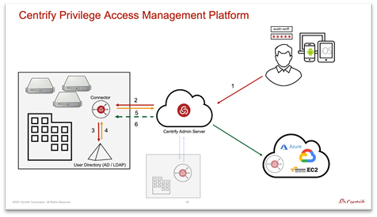
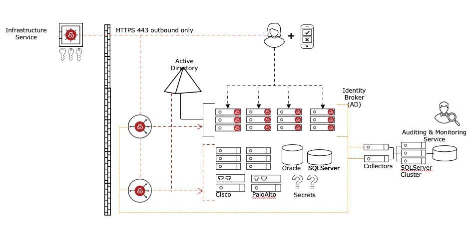

.. _m1:

---------------------
The Centrify Platform
---------------------

In this exercise you will be working with the Centrify Platform. While much of what you’ll see when navigating the platform are areas specific to Centrify’s vaulting capabilities, the platform is very much what ties together the various capabilities of legacy-Centrify’s cloud-first approach. That said, vaulting is only a portion of what the Centrify platform has been used for in the past. We will use this platform when connecting to systems, configuring MFA options, demonstrating AD-dependent functions, as well as those that are not. We will leverage the platform for workflow capabilities, as well

Centrify Platform Architecture
------------------------------

The Centrify Platform provides customers the means to establish sessions and manage PAM related permissions for their infrastructure, regardless of the location of each.

| Typically consumed as a SaaS solution, the Centrify Platform is always-on. First, an architectural review of the solution.

High-Level Architecture
***********************

The Centrify Agent (2007 - Current)
***********************************

Active Directory Dependent and it does not require integration with the Centrify Platform

The Centrify Cloud Client (2017 – Current)
******************************************

Centrify Platform dependent. Does not require Active Directory (can be used in conjunction with)

------

Use My Account
***************
 
To begin, we’ll first walk through the process by which a Centrify end-user/privileged user connects to infrastructure. There are many ways of doing this. With AD present, AD credentials will likely be used. This exercise, however, will demonstrate Centrify’s ability to connect users to infrastructure, independent of AD.

| That said, Use My Account (UMA) provides password-less authentication into target systems with high identity assurance. This approach is recommended for systems in untrusted environments (e.g., public cloud or some types of DMZ), and/or systems not joined to Active Directory. The feature allows the use of an ephemeral SSH “certificate” as opposed to an asymmetric encryption key. SSH keys are indefinite, require creation, distribution, and management, all which are not desirable. SSH certificates are finite with an expiration and therefore do not require management/rotation.

#. Open the **Centrify** server and login as **Alex Foster**
#. Expand *Resources* and click on *Systems*
#. Right-click **CentOS 8** and select *Use My Account*
#. When prompted for MFA, select *Security Question*. Answer: **red**

Password Reconciliation
***********************

Centrify has the feature to reconcile passwords even if they were manually changed and are out-of-sync with the password vault.

#. Expand *Resources* and select *Systems*
#. Click on **CloudVM**
#. Scroll to the right and verify that the local **ec2user** account is *managed by Centrify*
#. Right-click *ec2user* and **login**
#. Issue **su** and when prompted use the password **Centr1fy**
#. Change the password for the local account ec2user by issuing `passwd ec2user` - Use **ZeroTrust1** for the new password

   .. figure:: images/lab-004.png

#. The password is now out-of-sync with the The Centrify Platform
#. Return to the Admin Portal; expand Resources and click on Systems
#. Click on **CloudVM**
#. Under **Accounts**, right-click on *ec2user* and select **Verify Credential**

   .. figure:: images/lab-005.png

#. You will notice at the **top-center** of the screen that the test will fail

   .. figure:: images/lab-006.png

#. In order to reconcile the password, right-click **ec2user** and select **Rotate Credential**. Click **Yes** upon receiving the Rotate Credential prompt and close the confirmation pop-up window. 

   .. Note:: 
       The **Login** option will also reconcile the password automatically

   .. figure:: images/lab-007.png

#. Under **Accounts**, select **ec2user** and from the **Actions** button select **Verify Credential**. The verification test will now pass

RDP Session Gateway
*******************

In some cases, you might want to log on remotely to a target system using a stored account, but without using the Portal at all. You can do so by specifying the Centrify Gateway Connector host name or IP address. You use a cloud user’s username to begin the session along with the connector IP/FQDN and port. The Centrify Gateway Connector port is the port specified in the Centrify Gateway Connector settings.

#. Log in to the **Centrify** server as **afoster**
#. On your desktop, locate the RDP Session Gateway shortcut and **right-click on it**
#. Select **Edit** to verify how it works

   .. figure:: images/lab-008.png

#. Click **Connect** to start the RDP session
#. Enter the default password (*Centr1fy*)
#. Select for the MFA, **Security Question** (Option 3)
#. When prompted for the **MFA** question, enter **red**

   .. figure:: images/lab-009.png

#. Note that you were able to Start the RDP session using a local account without going to the Centrify Portal
 

SSH Session Gateway
*******************

The same feature is also available to SSH into \*NIX systems.

#. Log in to the **Centrify** server as **afoster**
#. Locate and start **PuTTY** from your Windows Task Bar
#. Click on *CloudVM_SSH_Gateway* and click **Load**
#. Note the **Host Name** string

   .. figure:: images/lab-010.png

#. Click **Open** and use the default password (*Centr1fy*)

Access Request & Approval Workflow
**********************************
 
#. Log in to the **Centrify** server as **afoster**
#. Click on the **Admin Portal** shortcut on your desktop (log in as **afoster** if prompted for login) 
#. Click on the SessionBox extension on your browser and then click on the **plus** sign, to create a new tab

   .. figure:: images/lab-011.png

#. On the new tab, log in as **lbennett**. When prompted for *MFA*, select **Security Question (3)**. Answer: **red**
#. Expand **Resources** and click on **Systems**
#. Click on **Domain Controller** and under **Accounts**, right-click **administrator**
#. Request access through the **Centrify Access Request & Approval Workflow** feature. Click on **Request Login** to proceed
#. A *Request Login* window will pop up, accept default values, and click on **Submit**

   .. figure:: images/lab-012.png

#. From the **Windows Task Bar**, locate and start Mozilla **Thunderbird**
#. Alex Foster was notified through email about the ***Account access request***. This request can also be seen and approved/rejected from the Centrify Mobile App. This environment does not include testing the Centrify Mobile App

   .. figure:: images/lab-013.png

#. Open the email and click on **View Request**. This will take you to the Admin Portal
#. This page contains the **Request Details**. **Approve** the request

   .. figure:: images/lab-014.png

#. Return to the second *Chrome Tab* where **lbennet** is logged in and *refresh* the page
#. Under **Accounts, right-click administrator** and click **Login**

   .. figure:: images/lab-015.png

Desktop Apps
************

The Desktop App feature in the Centrify Platform launches a Windows application (e.g., applications such as SQL Server Management Studio, TOAD for Oracle, and VMware vSphere Client) with a vaulted admin user on an instance of a Windows Server. That way you can enable a DBA for example to connect to a database without disclosing the password, and the session can be recorded. This section will portray how that’s done.

#. Log in to the **Centrify** server as **afoster** 
#. Open the **Admin Portal**, expand *Apps*, and click on **Desktop Apps**
#. Right-click **SQL Server Management Studio** and select **Launch**

   .. figure:: images/lab-016.png

#. You can now browse through the SQL Server Management Studio
#. Exit out of the session

Gateway Session Monitoring
**************************
 
#. Log in to the **Centrify** server as **afoster**
#. Click on the **Admin Portal** shortcut on your desktop (log in as **afoster** if prompted for login)
#. Click on the S**essionBox** browser extension and then click on the **plus** sign to create a new tab

   .. figure:: images/lab-017.png

#. On the new tab, log in as **jmiller**. When prompted for *MFA*, select **Security Question**. Answer: **red**
#. Expand **Resources** and click on **Systems**
#. Right-click on the **Database** server and click on **Select/Request Account**
#. Double-click on **jmiller**. When prompted for MFA, select **Security Question**. Answer: **red**
#. Return to the first *Chrome Tab* where **afoster** is logged in
#. On the left pane, click on **Dashboards**. Select **Overview** from the drop-down options

   .. figure:: images/lab-018.png

#. Note the session you have open as Joe Miller is under **Active Sessions** at the bottom right corner (if you do not see anything, refresh your page)

   .. figure:: images/lab-019.png

#. Right-click *on the session* and select **Watch**. You can now watch the sessions side- by-side
#. **Close** the Watch window
#. Right-click on the active session and select **Terminate**. This will immediately terminate the session

   .. figure:: images/lab-020.png

#. Return to the session to view the termination message

Session Replay
**************
 
#. On the right pane, expand **Apps**, and click on **Desktop Apps**
#. Right-click **Audit Analyzer** and select **Launch**

   .. figure:: images/lab-021.png

#. Expand **Audit Session** and click on **All, Grouped by Machine**
#. Now you have a list of audited systems in this environment. 

   .. figure:: images/lab-022.png

#. Double-click **database.omicron.lab**. You will see a list of sessions from this system by users. Type **JMiller** right under User on the first column

   .. figure:: images/lab-023.png

#. Select the most recent session based on start or end time

   .. figure:: images/lab-024.png

#. Double-click on the session to replay it
#. Exit out of the session and close the browser

.. raw:: html

    

    <H2 style="color:#80BB01">This concludes this lab
    

